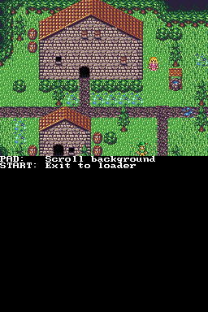
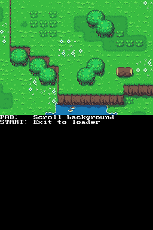
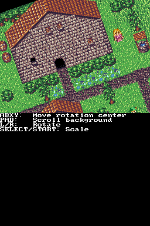
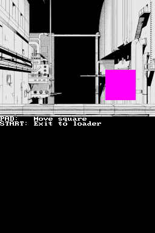
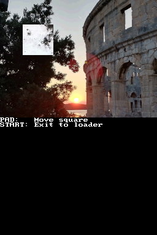
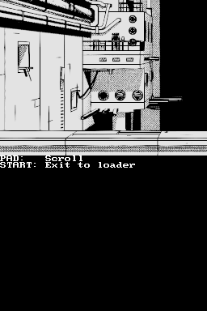

## 1. Introduction

Backgrounds are just the images in the background of your game. For example, if
you have a game in which your main character is walking through a forest, the
main character is formed of sprites, and the forest is drawn with backgrounds.

The introduction of [this chapter of Tonc](https://gbadev.net/tonc/regbg.html)
may be interesting to read.

## 2. 2D video modes

Both graphics engines of the DS can display up to 4 backgrounds per screen. The
video mode of an engine decides how many backgrounds are available on that
engine and their type. This is the list of modes of the main engine and their
meaning:

Mode | Layer 0 | Layer 1 | Layer 2  | Layer 3
-----|---------|---------|----------|-----------
 0   | Regular | Regular | Regular  | Regular
 1   | Regular | Regular | Regular  | Affine
 2   | Regular | Regular | Affine   | Affine
 3   | Regular | Regular | Regular  | Extended
 4   | Regular | Regular | Affine   | Extended
 5   | Regular | Regular | Extended | Extended
 6   | -       | -       | Large    | -

- **Regular**: Tiled backgrounds. Up to 1024 tiles in total. Tiles can be
  flipped vertically or horizontally. Each tile can use a different palette.
  Valid sizes: 256x256, 512x256, 256x512, 512x512 pixels. There are two color
  modes: one palette of 256 colors or 16 palettes of 16 colors each.

- **Affine**: Tiled backgrounds that can be rotated and scaled. Limited to 256
  tiles in total, and they can only use one 256-color palette. Tiles can't be
  flipped or rotated. Valid sizes: 128x128, 256x256, 512x512 and 1024x1024
  pixels.

- **Extended**: This can be configured as a bitmap backgrounds (with a 256-color
  palette or direct-color) or an affine background. If set as an affine
  background, it can have up to 1024 tiles which can be flipped horizontally and
  vertically, and each tile can have a different palette.

  Valid sizes:

  - Extended affine: 128x128, 256x256, 512x512 and 1024x1024.
  - 256-color bitmap: 128x128. 256x256, 512x256, 256x512, 512x512
  - Direct-color bitmap: 128x128. 256x256, 512x256, 256x512 and 512x512.

- **Large**: 256-color bitmap that can be rotated and scaled and use all 512 KB
  of the for main VRAM banks for the bitmap. Valid sizes: 1024x512 and 512x1024.

The only difference between the main and sub engines is that mode 6 isn't
available in the sub engine.

Note: There are some special modes in the main engine we haven't discussed here.
They are used for some special effects and they will be discussed in future
chapters. Also, the 3D output replaces layer 0 regardless of the 2D video mode.

## 3. Displaying regular backgrounds

We're finally going to see an example of displaying a regular background. You
can open [`examples/graphics_2d/bg_regular_8bit`](https://github.com/blocksds/sdk/tree/master/examples/graphics_2d/bg_regular_8bit),
if you want to have a look at the code while reading this section. You can try
to build the example first, the output should be something like this (which you
can scroll with the D-Pad):



Now, let's understand how the code works.

First, we need to check how to add an image to the project. The default build
system of BlocksDS uses grit to convert graphics from PNG into whichever DS
format you need. Images are placed in a folder in your project (in the example
it's called `graphics`). The `Makefile` needs to be told to look for graphics in
that folder. You also need to add instructions for grit to know what to do: each
PNG file needs to have instructions on how to convert it. Remember that you
don't need to call grit manually, the build system will do it for you.

In this case, we're using a 256x256 regular PNG image. Be careful to not use
more than 256 colors, or 255 if you want it to have transparent areas. If you
want, you can use indexed-mode PNG files, but any PNG file will work.

The conversion instructions are saved in `.grit` files with the same name as the
PNG file. They are just text files with `.grit` extension. In this example, it
looks like this:

```sh
# 8 bpp, tiles, export map, not compressed
-gB8 -gt -m
```

`-gB8` tells grit to work in 8 bit per pixel mode. It will create one palette of
256 colors. `-gt` tells grit to create a tiled map. `-m` tells grit to also
export the tile map. The palette is exported by default (you can request it
explicitly with `-p`).

Now we need to see how to use the converted graphics. Each pair of `.png` and
`.grit` files create a `.h` file that has to be included in the source code. In
this case we have `forest_town.png` and `forest_town.grit`, so `forest_town.h`
is created automatically.

Let's go through the main code to get this working:

```c
#include <nds.h>

// This file contains pointers to the data: `forest_townTiles`, `forest_townMap`
// and `forest_townPal`. It also contains the size of everything:
// `forest_townTilesLen`, etc.
#include "forest_town.h"

int main(int argc, char *argv[])
{
    // Use a video mode that sets layer 0 as a regular tiled background. Mode 0
    // sets all 4 layers as regular tiled backgrounds.
    videoSetMode(MODE_0_2D);

    // Designate VRAM A as memory for main engine backgrounds. This gives us 128
    // KB in total.
    vramSetBankA(VRAM_A_MAIN_BG);

    // Initialize layer 0 as a regular (text) background with 256 colors (8 bpp)
    // and size 256x256. The last 0 is the map base and the 1 is the tile base.
    // We'll talk about that in a minute.
    int bg = bgInit(0, BgType_Text8bpp, BgSize_T_256x256, 0, 1);

    // Copy tiles and tile map to VRAM
    dmaCopy(forest_townTiles, bgGetGfxPtr(bg), forest_townTilesLen);
    dmaCopy(forest_townMap, bgGetMapPtr(bg), forest_townMapLen);

    // Copy palete to palette RAM
    dmaCopy(forest_townPal, BG_PALETTE, forest_townPalLen);

    // Wait forever
    while (1)
        swiWaitForVBlank();
}
```

The example `examples/graphics_2d/bg_regular_8bit` also shows you how to scroll
the background with `bgSetScroll(bg, x, y)`. The most important thing to
remember is that this function alone won't update the background, it will simply
tell libnds to update the scroll to the right values the next time `bgUpdate()`
is called.

To finish this section let's see how to create a background that uses 16
palettes of 16 colors instead. You can open
[`examples/graphics_2d/bg_regular_4bit`](https://github.com/blocksds/sdk/tree/master/examples/graphics_2d/bg_regular_4bit),



There are only two differences you need to check. The first one is the grit
file:

```sh
# 4 bpp, tiles, export map, flat layout, not compressed
-gt -gB4 -mR4 -mLf
```

And the second one is the way to setup the background (use `BgType_Text4bpp`
instead of `BgType_Text8bpp`):

```c
int bg = bgInit(0, BgType_Text4bpp, BgSize_T_256x256, 0, 1);
```

## 4. Tile bases and map bases

The purpose of palette VRAM is very clear: It contains palettes. However, the
rest of VRAM isn't so restrictive: You can copy tiles and maps wherever you
want. You are free to organize how your data is saved in VRAM. However, that
means you are in charge of it as well, so you need to learn how to work with
this system.

Background VRAM is divided in tile slots (where you copy your tiles) and map
slots (where you copy your maps). Tile slots are much bigger than map slots (8
map slots fit in one tile slot), and they overlap each other. Map slots 0 to 7
use the same physical memory as tile slot 0.

However, a map slot only has space for a 256x256 pixels map. The maximum size of
a regular map is 512x512 pixels, which requires 4 map slots. The same thing
happens with tiles. If you want to store the maximum number of tiles for a map
(1024) you need 4 tile slots.

Bitmap backgrounds use the same system for map slots, but they don't use tile
slots (because they aren't formed of tiles!).

This system lets you have multiple backgrounds on one screen with a lot of
flexibility.  If you have a very small background that uses very few tiles it
will require just one map slot and one tile slot (you can even share the tile
slot with another map). If you have a very big background with the maximum
number of tiles you will need to assign more slots to it.

This whole system is very complicated and error-prone, so I recommend you to use
this tool by mtheall & JustBurn:

https://mtheall.com/vram.html

## 5. Displaying affine backgrounds

Affine backgrounds work almost the same as regular backgrounds, so you don't
need to learn anything new! The main difference is that they can be rotated and
scaled.

Check [`examples/graphics_2d/bg_rotation`](https://github.com/blocksds/sdk/tree/master/examples/graphics_2d/bg_rotation)
if you want to have a look at the code while reading this section. If you build
it you can rotate it, scale it and scroll it. It should look like this:



We need to convert the image in a different way:

```sh
# 8 bpp, tiles, export map, affine, not compressed
-gB8 -gt -m -mLa
```

The difference is `-mLa`, which switches the background mode from regular format
to affine format.

In the code, the main two differences are the video mode and the way in which
you initialize the background:

```c
videoSetMode(MODE_2_2D);

int bg = bgInit(2, BgType_Rotation, BgSize_R_256x256, 0, 1);
```

Video mode 2 sets layers 0 and 1 as regular backgrounds and layers 2 and 3 as
affine backgrounds. Then, layer 2 is setup as an affine (rotation) background of
dimensions 256x256 pixels. The code that loads the graphics is the same.

The main reason to use an affine background is to transform it. This is achieved
by setting a center of transformations for the background, a rotation, a scale
factor, and a scroll.

If you want more detail about how the transformation works, check
[this chapter of Tonc](https://gbadev.net/tonc/affine.html), and check
[this other chapter](https://gbadev.net/tonc/affbg.html) to see how it applies
to affine backgrounds. In this tutorial we will focus on how to use libnds
directly, so you don't need to worry about the low-level details.

The center of rotation is defined with `bgSetCenter(bg, center_x, center_y)`.
The values of `center_x` and `center_y` are fixed point values with a fraction
part of 8 bits. Normally, the background is rotated around (0, 0). If you want
it to rotate around a different point you will need to use this function.

If you want to rotate the background, use `bgRotate(bg, angle)`. If you want to
scale it, use `bgSetScale(bg, sx, sy)`. If you want to do both at the same time,
use `bgSetRotateScale(bg, angle, sx, sy)`. Scale factors are fixed point values
with a fraction of 8 bits. Angles go from 0 to 32768: If you want to rotate the
image 180 degrees, use an angle of 16384. If you want to rotate the image 90
degrees, use an angle of 8192.

Finally, you can also scroll the background like regular backgrounds with
`bgSetScroll(bg, x, y)`, but this function doesn't have as much accuracy as
possible because it scrolls by whole pixels. If you scale a background you may
need finer scroll values than one pixel. In that case, use the function
`bgSetScrollf(bg, x, y)`, which uses fixed point values with a fraction of 8
bits.

## 6. Extended affine backgrounds

Extended affine backgrounds are just like affine backgrounds, but without the
limitation of 256 tiles and the inability to flip tiles of affine backgrounds.
It behaves like a regular background that can be rotated and scaled.

Check [`examples/graphics_2d/bg_ext_rotation`](https://github.com/blocksds/sdk/tree/master/examples/graphics_2d/bg_ext_rotation).

There is no screenshot for this example because it's the same one as for affine
backgrounds.

The only things to consider is that:

- The instructions for grit are the same as for a regular background, not for an
  affine background.

- The video mode and initialization of the background are slightly different:

  ```c
  videoSetMode(MODE_5_2D);

  int bg = bgInit(2, BgType_ExRotation, BgSize_ER_256x256, 0, 1);
  ```

  Mode 5 sets layers 0 and 1 as regular backgrounds and layers 2 and 3 as
  extended backgrounds.

## 7. Displaying 256-color (8 bits per pixel) bitmaps

The good news is that the two previous modes were the hardest ones to
understand! From this point, it's easier.

Bitmap modes are ideal to display images that don't follow any grid-like
pattern. Check [`examples/graphics_2d/bg_bmp_8bit`](https://github.com/blocksds/sdk/tree/master/examples/graphics_2d/bg_bmp_8bit):



The first important thing to mention are the instructions passed to grit:

```
# 8 bpp, bitmap, set magenta as transparent color, not compressed
-gB8 -gb -gTFF00FF
```

In this case, the `-gt` (generate tiled map) option isn't used: `-gb` (generate
bitmap) is used instead. Another new option is `-gTFF00FF`, which tells grit to
leave palette index 0 as a transparent color and to treat magenta (colour
`FF00FF`) as a transparent color.

The code to load this is:

```c
#include <nds.h>

#include "manga_bg.h"

int main(int argc, char *argv[])
{
    // With mode 5 layers 2 and 3 are extended background layers, which can be
    // setup as bitmap backgrounds.
    videoSetMode(MODE_5_2D);

    // The screen is 256x192 pixels. A 8-bit bitmap that size requires 48 KB
    // (256 x 192 / 1024). Each VRAM bank is 128 KB, so we can store two bitmaps
    // in a single VRAM bank.
    vramSetBankA(VRAM_A_MAIN_BG);

    // Setup layer 2 as an 8-bit bitmap background with size 256x256
    int bg = bgInit(2, BgType_Bmp8, BgSize_B8_256x256, 0, 0);

    // Load the palette and the bitmap
    dmaCopy(manga_bgPal, BG_PALETTE, manga_bgPalLen);
    dmaCopy(manga_bgBitmap, bgGetGfxPtr(bg), manga_bgBitmapLen);

    // Wait forever
    while (1)
        swiWaitForVBlank();
}
```

There isn't much more to it. You load the background, the palette, and that's
it.

One of the advantages of bitmap modes is that they are easy to edit by hand.
However, instead of editing the current image being displayed, you should use a
double buffer setup. The code in `examples/graphics_2d/bg_bmp_8bit` shows you
how to use two buffers in such a way that you can draw on the background without
any tearing or video synchronization issues (note that `bgSetMapBase()` doesn't
need `bgUpdate()` to update the map base):

```c
    uint16_t *backbuffer = bgGetGfxPtr(bg);

    // Bitmap base 0 is at offset 0 (start of VRAM A) and bitmap base 8 is
    // at offset 64 KB (4 * 128 * 128 B) (middle of VRAM A).
    if (bgGetMapBase(bg) == 4)
        bgSetMapBase(bg, 0);
    else
        bgSetMapBase(bg, 4);

    // Now you can edit the data in `backbuffer`, which will be displayed in the
    // next frame.
```

One last thing: You can rotate and scale bitmap backgrounds as well! Do it the
same way as with affine backgrounds, and don't forget calling `bgUpdate()`.

## 8. Displaying direct-color (16 bits per pixel) bitmaps

This kind of bitmaps allow you to display any image you want without
restrictions, and it's the easiest to setup! However, it's also the slowest one
to deal with, and the one that uses the most VRAM, so it's not very well-suited
for regular games. It's ideal for photos, for example.

Check [`examples/graphics_2d/bg_bmp_16bit`](https://github.com/blocksds/sdk/tree/master/examples/graphics_2d/bg_bmp_16bit):



This is how you convert graphics for this format:

```
# 16 bpp, bitmap, set alpha bit to 1, not compressed
-gB16 -gb -gT!
```

`-gB16` sets the bit depth to 16 bits, `-gb` generates a bitmap, and `-gT!`
removes all transparency from the final image (you can use `-gTFFOOFF` or
similar arguments if you want some pixels to be transparent!).

```c
#include <nds.h>

#include "photo.h"

int main(int argc, char *argv[])
{
    videoSetMode(MODE_5_2D);

    // The screen is 256x192 pixels. A 16-bit bitmap that size requires 96 KB
    // (256 x 192 x 2 / 1024). Each VRAM bank is 128 KB, so we need one full
    // bank to display this background.
    vramSetBankA(VRAM_A_MAIN_BG);

    // Setup layer 2 as a 16-bit bitmap
    int bg = bgInit(2, BgType_Bmp16, BgSize_B16_256x256, 0, 0);

    // Load bitmap
    dmaCopy(photoBitmap, bgGetGfxPtr(bg), photoBitmapLen);

    while (1)
        swiWaitForVBlank();
}
```

That's it. No palettes, no tiles... you just copy the bitmap, and it's done.

It's also interesting to mention that this mode is great if you want to be able
to modify the image without any restriction. 8-bit bitmaps can be a bit annoying
because you are restricted to the colors in the 256-color palette. With a 16-bit
bitmap you can draw without any limitation.

If you want to setup a double buffering system you will need to use two VRAM
banks, though. Check `examples/graphics_2d/bg_bmp_16bit` for more details. The
idea is the same as with 8-bit double buffering setups, but reserving more space
for each buffer.

## 9. Displaying large 256-color bitmap backgrounds

This mode is just a larger 256-color bitmap backgrounds than the ones explained
before. Note that only the main engine can be set in this mode.

Check [`examples/graphics_2d/bg_bmp_8bit_large`](https://github.com/blocksds/sdk/tree/master/examples/graphics_2d/bg_bmp_8bit_large):



The instructions passed to grit are the same as with regular 8-bit backgrounds:

```
# 8 bpp, bitmap, set magenta as transparent color, not compressed
-gB8 -gb -gTFF00FF
```

The code to load this is a bit different:

```c
#include <nds.h>

#include "manga_bg.h"

int main(int argc, char *argv[])
{
    // With mode 6 only layer 2 is available, and it's a large 256-color bitmap
    videoSetMode(MODE_6_2D);

    // Video mode 6 is designed to display a large bitmap stored in all primary
    // VRAM banks: 128 KB * 4 = 512 KB in total.
    vramSetPrimaryBanks(VRAM_A_MAIN_BG_0x06000000,
                        VRAM_B_MAIN_BG_0x06020000,
                        VRAM_C_MAIN_BG_0x06040000,
                        VRAM_D_MAIN_BG_0x06060000);

    // Valid sizes are 1024x512 and 512x1024
    int bg = bgInit(2, BgType_Bmp8, BgSize_B8_1024x512, 0, 0);

    // Load the palette and the bitmap
    dmaCopy(manga_bgPal, BG_PALETTE, manga_bgPalLen);
    dmaCopy(manga_bgBitmap, bgGetGfxPtr(bg), manga_bgBitmapLen);

    // Wait forever
    while (1)
        swiWaitForVBlank();
}
```

You can rotate it, scale it and scroll it (remember to call `bgUpdate()`
afterwards).

One trick that you can use is that, if you don't need the full size of the
bitmap, you can use VRAM banks for other things, and it will work. For example,
if you want a 1024x256 background you can assign VRAM A and B as main engine
background RAM, tell `bgInit()` that you want a 1024x512 bitmap, and the 2D
engine will only be able to use those banks for the bitmap. You'll be free to
use VRAM C and D for other things.

## 10. Background priorities

The last thing to mention in this super long chapter is that you can change the
priorities of all background layers on the screen. The table with the video
modes may give you the impression that the order in the table is the order of
priorities of the layers, but you can change it by calling
`bgSetPriority(bg, priority)` for each layer.

The highest priority is priority 0, which is displayed on top of priorities 1,
2 and 3. If two layers have the same priority, the one with the lowest index
is displayed on top.
