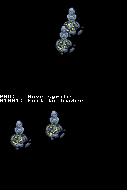
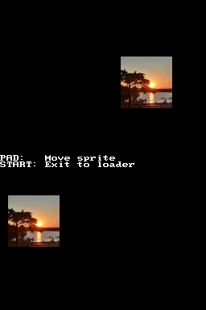
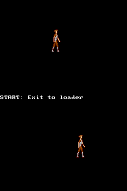

## 1. Introduction

Sprites are smaller images than backgrounds that you can move individually. You
can display up to 128 sprites per screen. Most of the moving objects in games
are displayed using sprites.

Sprites simpler than backgrounds in some ways:

- There are no video modes that affect which kind of features you can use. Any
  sprite can be set to any graphics mode without affecting any other sprite.

- Sprites can only use one palette, unlike backgrounds that can use up to 16.

But more restrictive in others:

- You can rotate and scale all sprites on the screen (you can only rotate up to
  two background layers), but there can only be a total of 32 different
  transformations that are shared between all 128 sprites.

- You need to choose between using all of the available VRAM for sprites or
  having a fine granularity. This is done through the selection of a mapping
  mode.

There are three types of sprites you can display:

- 16-color tiled sprites.
- 256-color tiled sprites.
- Direct-color bitmap sprites.

Note that there isn't the option of using 256-color bitmap sprites.

Also, sprites must be of some specific sizes: 8x8, 16x16, 32x32, 64x64, 16x8,
32x8, 32x16, 64x32, 8x16, 8x32, 16x32 and 32x64. Other sizes are not allowed.

Something to consider is that there is a limit to the number of sprites that can
be displayed in an horizontal line of the screen (scanline). The 2D engine has a
limited time to draw sprites. Regular sprites take some time to be drawn, affine
sprites take more time. If the graphics engine runs out of time, some sprites
won't be displayed.

## 2. Mapping modes for tiled sprites

Tiled sprites can be stored in VRAM in 1D or 2D mapping modes. You can find more
information in [this Tonc chapter](https://gbadev.net/tonc/regobj.html).
However, 2D mapping mode isn't really useful, and it will be ignored in this
tutorial.

In 1D mapping mode you need to select the amount of memory that is available for
the graphics engine for sprites:

Maximum accessible memory | Size of a tile entry
--------------------------|---------------------
32 KB                     | 32 bytes
64 KB                     | 64 bytes
128 KB                    | 128 bytes
256 KB                    | 256 bytes

A quick explanation is that, when you define the graphics location of a sprite,
you don't specify an address, but a tile index. The location of the graphics of
the sprite in VRAM are calculated as the base of VRAM plus the tile index
multiplied by the size of a tile entry.

Essentially, the more VRAM you want to access for sprites, the lower your
granularity is. For example, if the mapping mode is set to 32 KB of VRAM, your
tile entries are as big as a 8x8 tile of a 16-color sprite (which is the
smallest sprite size that makes sense). If you set it to 256 KB, the smallest
unit you can define is a group of four 8x8 tiles of a 256-color sprite.

Note that the sub video engine can only access 128 KB of VRAM for sprites, so
the last mapping mode isn't useful (it limits your granularity, and it doesn't
help you use more memory).

In the main engine you can use VRAM banks A, B, E, F and G for sprites, which
gives you a lot of flexibility. You can assign from 16 KB of VRAM to 256 KB.

In the sub engine you can only use banks D and I for sprites, so you need to
choose between 128 KB or 16 KB, with no other options in between.

A simple rule to choose your mapping is to use the mode that lets you access as
much memory as you have allocated for sprites and no more than that.

For example, if you want to use 128 KB of VRAM for sprites, you would initialize
the OAM structure of libnds like this:

```c
oamInit(&oamMain, SpriteMapping_1D_128, false);
```

If you want to use 256 KB:

```c
oamInit(&oamMain, SpriteMapping_1D_256, false);
```

The sprite allocation routines of libnds are prepared to handle allocations in
any mapping mode correctly.

## 3. Mapping modes for bitmap sprites

The same way as tiled sprites, there is a 1D and a 2D mapping mode. We will
only use the 1D mapping mode.

Maximum accessible memory | Size of an entry
--------------------------|-----------------
128 KB                    | 128 bytes
256 KB                    | 256 bytes

The address in VRAM of the sprite graphics is calculated as as the base of VRAM
plus the entry index multiplied by the size of an entry.

A 128 bytes entry is equivalent to a 8x8 direct-color tile. A 256 bytes is
equivalent to two tiles.

In the sub video engine only the mode with 128 KB of VRAM makes sense because
you can only assign up to 128 KB of VRAM for sprites.

A simple rule to choose your mapping is to use the mode that lets you access as
much memory as you have allocated for sprites and no more than that.

For example, to use 128 KB of VRAM for sprites:

```c
oamInit(&oamMain, SpriteMapping_Bmp_1D_128, false);
```

## 4. Using tiled and bitmap sprites at the same time

If you want to use bitmap sprites and you set a mapping mode it will also set
the mapping mode for tiled sprites that allows access to the same amount of
memory.

For example, this:

```c
oamInit(&oamMain, SpriteMapping_Bmp_1D_128, false);
```

Will also have the same effect for tiled sprites as calling this:

```c
oamInit(&oamMain, SpriteMapping_1D_128, false);
```

However, this doesn't work in the other direction. You must always set a valid
sprite mapping mode for bitmap sprites if you want to use bitmap sprites.

## 5. Displaying regular sprites

Now, let's learn how to display sprites. You can see a more detailed example of
regular sprites in [`examples/graphics_2d/sprites_regular`](https://github.com/blocksds/sdk/tree/master/examples/graphics_2d/sprites_regular):



The image has to be converted in a similar way as backgrounds, but we use `-m!`
to tell grit that we don't need a map, just tiles.

```sh
# 8 bpp, tiles, not compressed
-gB8 -gt -m! -gTFF00FF
```

Now that we know how to convert the images, we need to see how to use them. This
is a bit different than backgrounds because libnds gives you some functions to
allocate sprites for you in VRAM, so you don't have to think about it (in the
case of backgrounds you're expected to decide which tile and map slots you use).

```c
#include <nds.h>

// This is autogenerated from statue.png and statue.grit
#include "statue.h"

int main(int argc, char *argv[])
{
    // Any video mode will work
    videoSetMode(MODE_0_2D);

    // Reserve 128 KB for sprites in the main 2D graphics engine
    vramSetBankA(VRAM_A_MAIN_SPRITE);

    // Initialize the oamMain struct of libnds to be able to contain up to
    // 128 KB of VRAM for sprites. The last argument disables extended palettes
    // (we will see how to use them later).
    oamInit(&oamMain, SpriteMapping_1D_128, false);

    // Allocate space for the tiles of a 256-color 64x64 sprite. Note that the
    // tiles can be used by any sprite on the screen. If you want to display 128
    // copies of the same sprite you only need to copy the tiles once.
    u16 *gfxMain = oamAllocateGfx(&oamMain, SpriteSize_64x64, SpriteColorFormat_256Color);

    // Copy tiles to the space assigned to this sprite
    dmaCopy(statueTiles, gfxMain, statueTilesLen);

    // Copy palette to the palette RAM
    dmaCopy(statuePal, SPRITE_PALETTE, statuePalLen);

    oamSet(&oamMain,
           0, // Sprite ID (0 to 127)
           100, 50, // X, Y
           0, // Priority
           0, // Palette index
           SpriteSize_64x64, SpriteColorFormat_256Color, // Size, format
           gfxMain,  // Graphics offset
           -1, // Affine index (unused in this example)
           false, // Double size for affine sprites
           false, // Hide
           false, false, // H flip, V flip
           false); // Mosaic

    // If you want, you can call oamSet() again with other sprite IDs and the
    // same graphics offset. That will display the same image but it won't use
    // any more VRAM.

    while (1)
    {
        swiWaitForVBlank();

        // Update OAM during the vertical blanking period
        oamUpdate(&oamMain);

        // You can also move the sprite with `oamSetXY()` here
    }

    // Eventually you can call this function to free up the space in VRAM used
    // by the tiles of this sprite.
    oamFreeGfx(&oamMain, gfxMain);

    return 0;
}
```

The structure `oamMain` (and `oamSub`) is an internal library of libnds that
contains all the information of the sprites in the main 2D engine (or the sub
engine). Whenever you use any function that modifies sprites, the changes are
stored in the specified struct. If you want the changes to be applied to the
screen, you need to call `oamUpdate()` to copy them to the actual graphics
engine RAM. This is copied to some special RAM called "OAM" (Object Attribute
Memory), so it doesn't use any space in any of the VRAM banks.

Note that `oamUpdate()` should be called during the vertical blanking period.
This function refreshes all of the OAM, but the actual size of OAM isn't that
big (512 bytes per engine (4 bytes per sprite, 128 sprites), so it's a good idea
to update it every frame even if you haven't changed anything.

## 6. Affine sprites

Affine sprites work in a very similar way as regular sprites. The main
difference is that you need to specify in `oamSet()` an affine index. You don't
even need to change the instructions passed to grit.

Check the example in [`examples/graphics_2d/sprites_affine`](https://github.com/blocksds/sdk/tree/master/examples/graphics_2d/sprites_affine):


First, let's take a look at `oamSet()`. The two parameters you need to check are
"affine index" and "double size for affine sprites":

```c
oamSet(&oamMain,
       0, // Sprite ID (0 to 127)
       100, 50, // X, Y
       0, // Priority
       0, // Palette index
       SpriteSize_64x64, SpriteColorFormat_256Color, // Size, format
       gfxMain, // Graphics offset
       0, // Affine index
       true, // Double size for affine sprites
       false, // Hide
       false, false, // H flip, V flip
       false); // Mosaic
```

The affine index corresponds to one of 32 transformation matrices available for
each 2D engine. Multiple sprites can share the same matrix by setting the same
index in `oamSet()` (0 to 31).

If you want to setup the transformation of a matrix, do it like this:

```c
oamRotateScale(&oamMain, 0, angle, scale_x, scale_y);
oamUpdate(&oamMain);
```

The last detail to explain is the meaning of that "double size" flag. If you
check the screenshot, there are two sprites on each screen. One of them looks
cropped, the other one is full.

When sprites are rotated/scaled, the canvas that contains the sprite doesn't
actually change. If your sprite is exactly 64x64 pixels in size when you rotate
it 45 degrees the corners will be cut off.

The "double size" flag is a workaround that duplicates the canvas size to
128x128 in this case, so that the full sprite can be displayed. This is also
useful if you want to scale the sprite and make it bigger than the original
size.

However, as mentioned in the introduction, there is a limited number of sprites
that can be displayed per screen. Affine sprites are costly for the graphics
engine, and double size sprites are even costlier. If you want to display lots
of sprites with lots of transformations, you may be interested in displaying 2D
sprites with the 3D engine (which will be explained in another chapter).

## 7. Bitmap sprites

The main advantage of bitmap sprites is that they always use direct color (16
bits per pixel) so you don't have any limitation due to requiring a palette.

Check the example in [`examples/graphics_2d/sprites_bitmap`](https://github.com/blocksds/sdk/tree/master/examples/graphics_2d/sprites_bitmap):



The main difference is in the instructions passed to grit:

```sh
# 16 bpp, bitmap, not compressed
-gB16 -gb -gT000000
```

Then, when you display the sprite:

```c
u16 *gfxMain = oamAllocateGfx(&oamMain, SpriteSize_64x64, SpriteColorFormat_Bmp);
dmaCopy(photoBitmap, gfxMain, photoBitmapLen);

oamSet(&oamMain, 0,
       150, 70, // X, Y
       0, // Priority
       15, // Palette index, but it is the alpha value of bitmap sprites
       SpriteSize_64x64, SpriteColorFormat_Bmp, // Size, format
       gfxMain,  // Graphics offset
       -1, // Affine index
       false, // Double size
       false, // Hide
       false, false, // H flip, V flip
       false); // Mosaic
```

Note that we have changed the color format of `oamAllocateGfx()` and `oamSet()`
to `SpriteColorFormat_Bmp`. Also, note that the palette index in `oamSet()` is
used as an alpha value for bitmap sprites. The alpha value goes from 0
(transparent) to 15 (opaque). However alpha blending between 2D sprites requires
a bit of care, so it will be explained later.

## 8. Animating sprites

Animating sprites works the same way regardless of the sprite type. This example
will demonstrate the system with regular sprites.

There are two main ways to animate a sprite: we can either load all frames to
VRAM from the start (high VRAM usage, low CPU usage), or we can load one frame
to VRAM and replace it by new ones whenever we want to change it (low VRAM
usage, high CPU usage). Which system you use depends on the particular
requirements of your game.

If you have multiple instances of the same animated sprite it's a good idea to
load all frames to VRAM from the start. For example, if you have 20 birds on the
screen and the animation consists on 5 different frames, it's a good idea to
load the 5 frames to VRAM instead of having one frame loaded per sprite and
having to replace them every time they change.

If you have a fighting game where each character is 64x64 pixels in size and it
can have 20 different animations, you won't be able to load all the frames to
VRAM at once, so you'll need to load one frame per character and replace them
whenever the animation needs to advance.

This example shows how to animate a sprite with both systems:
[`examples/graphics_2d/sprites_animated`](https://github.com/blocksds/sdk/tree/master/examples/graphics_2d/sprites_animated)



I recommend you to take a look at the example to see how to do it. The short
explanation is:

- All the frames of the animation are in the same PNG file. They need to be
  arranged vertically, and the settings in the `.grit` file are the same as for
  a non-animated sprite.

- To keep one frame in VRAM you call `oamAllocateGfx()` once, which will return
  a pointer to VRAM where you need to copy your frame. Whenever you want to
  update the frame, copy it to that pointer. You can pass this pointer to
  `oamSet()`. Any sprite that you display with `oamSet()` with this pointer will
  get updated at the same time when you replace the frame in VRAM.

- To keep all frames in VRAM you call `oamAllocateGfx()` once per frame, you
  copy each frame to each pointer, and call `oamSet()` with the pointer to the
  initial frame. To update the frame of each sprite displayed with `oamSet()`
  you need to call `oamSetGfx()` and set the pointer to a different frame. This
  will only affect the specific sprite index passed to `oamSetGfx()`.

## 9. Sprite priorities

There are two leves of priorities for sprites. First, sprites are ordered by ID.
Lower sprite IDs have a higher priority than higher sprite IDs (sprite 0 is
displayed on top of sprite 127).

However, you can set the sprite priority in `oamSet()`. This priority can be
used to specify in between which background layers the sprite is displayed.
Sprites are always displayed on top of backgrounds, so setting a sprite as
priority 2 will display that sprite on top of background layer 2.

The priority of `oamSet()` has priority over the sprite ID: Sprite ID 0 with
priority 2 will be displayed under sprite ID 60 with priority 0.
