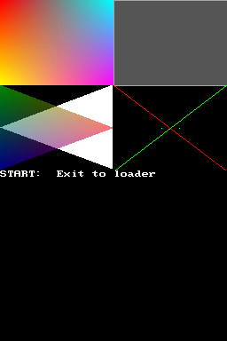
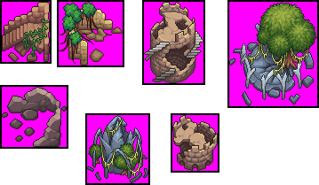
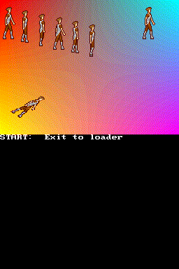
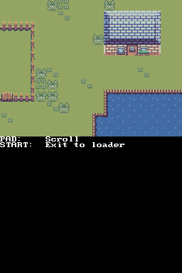
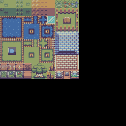

## 1. Introduction

The 2D hardware of the DS is very powerful, but it has some limitations that can
make developing some games difficult. For example, the 128 sprite limit can be a
problem in a bullet hell game, and the limit of 32 different rotations can
become a problem if you have more than 32 sprites that require to be rotated.

GL2D is a library built on top of libnds that uses the 3D hardware to draw 2D
graphics. The 3D hardware is a lot more powerful. It can draw up to 1536
individual quads that can be transformed in any way. They can be blended with
each other (something the 2D hardware doesn't allow), they go over the 64x64
pixels limit of 2D sprites, etc.

The main limitation of this library is that it can only be used on the main
screen of the DS because the sub graphics engine doesn't support 3D. It is
possible to display 3D on both screens by sacrificing half of the FPS of the
application, which will be explained in detail in a future chapter. In case you
can't wait, there is an example of how this system works here
[`examples/video_capture/dual_screen_3d`](https://github.com/blocksds/sdk/tree/master/examples/video_capture/dual_screen_3d).

Another downside of using GL2D is that you need to tell the GPU what to draw
every frame. With the 2D hardware you don't have to do anything once you've
configured your background and sprites unless something changes and, when
something changes, all you need to do is reconfigure the specific thing that has
changed. With the 3D hardware you need to send all the polygons to the GPU every
frame, which takes some CPU time.

A basic main loop of an application using GL2D looks like this:

```c
#include <nds.h>
#include <gl2d.h>

int main(int argc, char *argv[])
{
    // Set any video mode that you want, but enable 3D
    videoSetMode(MODE_0_3D);

    // Initialize GL2D
    glScreen2D();

    while(1)
    {
        // Start 2D scene
        glBegin2D();

        // ... GL2D rendering goes here ...

        // End 2D scene
        glEnd2D();

        glFlush(0);
        swiWaitForVBlank();
    }
}
```

## 2. Primitives

The most basic thing you can do with GL2D is to draw dots, lines and polygons
without textures. However, note that some emulators don't display dots and lines
correctly! Check the following example for a demonstration:
[`examples/gl2d/primitives`](https://github.com/blocksds/sdk/tree/master/examples/gl2d/primitives).



This example shows how to use all types of primitives supported by GL2D:

- You can draw dots by using `glPutPixel(x, y, color)`. The coordinates start at
  the top-left of the screen (0, 0) and they go up to (255, 191). Colors are
  defined as 15 bit colors with `RGB15(r, g, b)`, where the components r, g, and
  b range from 0 to 31.

- You can draw lines with `glLine(x1, y1, x2, y2, color)`.

- You can draw empty triangles with `glTriangle(x1, y1, x2, y2, x3, y3, color)`
  and filled triangles with `glTriangleFilled(x1, y1, x2, y2, x3, y3, color)`
  or `glTriangleFilledGradient(x1, y1, x2, y2, x3, y3, c1, c2, c3)`. The first
  one uses the same color for the whole triangle, while the second one uses a
  different color for each vertex of the triangle and it uses a gradient to fill
  the triangle.

- You can draw empty rectangles with `glBox(x1, y1, x2, y2, color)` and filled
  rectangles with `glBoxFilled(x1, y1, x2, y2, color)` (one single color) or
  `glBoxFilledGradient(x1, y1, x2, y2, c1, c2, c3, c4)` (one color per vertex).

Polygons are sorted based on the order they are drawn. New polygons are drawn
default on top of previously drawn polygons.

You will also notice that there are function calls like the following one:

```c
glPolyFmt(POLY_ALPHA(31) | POLY_CULL_NONE | POLY_ID(3));
```

This is used to adjust the level of transparency of polygons as well as other
properties. What we need to worry about right now is:

- `POLY_CULL_NONE`: The GPU can be told to cull (not draw) polygons that face
  away from the camera. The direction a polygon faces is determined by the order
  in which the vertices are drawn. When you're working with 2D graphics it's a
  good idea to disable this and cull no polygons because this will give you
  complete freedom to flip polygons horizontally or vertically without the GPU
  culling them.

- `POLY_ALPHA(alpha)`: This sets the level of transparency of all polygons drawn
  after this call to `glPolyFmt()`. 31 means fully opaque, 1-30 means
  translucent, and 0 means wireframe. In wireframe mode only the edges of
  polygons are drawn.

- `POLY_ID(id)`: This sets the polygon ID of the polygons drawn after this call
  to `glPolyFmt()`. Polygons with different IDs can be blended with each other,
  but polygons with the same ID can't be blended with each other. Polygon IDs go
  from 0 to 63.

Note that the effect of `glPolyFmt()` lasts until `glBegin2D()` is called again.

## 3. Sprite sets

You can use GL2D to display textured polygons of any size, which means you can
use them in a similar way as 2D sprites, but much more flexible. We'll get
started with this example: [`examples/gl2d/spriteset`](https://github.com/blocksds/sdk/tree/master/examples/gl2d/spriteset)

GL2D uses the 3D hardware to display polygons, so images displayed by GL2D are
just 3D textures. You can display any part of a texture in a polygon, so the
general idea is to pack a bunch of PNG files into a single PNG file (and a file
with information about the location of all original files), load the resulting
image as a texture, and use that texture whenever any of the images need to be
used. This allows us to pack a bunch of images of arbitrary sizes into a single
texture, which is a much better way to use VRAM than loading a lot of textures
with empty space.

The GPU of the DS requires textures to have sizes that are power of two. When
you have a bitmap with dimensions that aren't a power of two, padding needs to
be added to the bottom and to the right to fill the image up to a valid size.

For example, if you have a 40x68 image and you want to load it as a single
texture you need to pad it up to 64x128, which means that you're wasting a lot
of space. However, you can choose to pack a lot of images into a single 256x256
image so that all that empty space can be used in a better way. This system
generally works better when you have a lot of small images, or some big images
with some small images.

BlocksDS comes with a fork of [**squeezer** by Jeremy Hu](https://github.com/huxingyi/squeezer)
to pack images. For example, we can pack a few images named `1.png` to `7.png`
that are stored in a folder called `original_images` and look like this:



This command will create a file called `atlas_texture.png` and two other files
called `atlas.c` and `atlas.h` with the coordinates and sizes of the original
images. `ATLAS` will be the base name used for defines and array names:

```sh
/opt/blocksds/core/tools/squeezer/squeezerw \
    --outputTexture graphics/atlas_texture.png \
    --outputBaseName ATLAS \
    --outputH source/atlas.h --outputC source/atlas.c \
    --verbose \
    ./original_images
```

**atlas_texture.png**


**atlas.c**

```c
// Autogenerated file

#include <stdint.h>

const uint16_t ATLAS_texcoords[] = {
    171, 68, 54, 68, // 1.png
    99, 0, 72, 72, // 2.png
    136, 136, 51, 63, // 3.png
    171, 0, 73, 68, // 4.png
    67, 118, 69, 77, // 5.png
    0, 0, 99, 118, // 6.png
    0, 118, 67, 92, // 7.png
};
```

**atlas.h**

```c
// Autogenerated file

#ifndef ATLAS_H__
#define ATLAS_H__

#include <stdint.h>

#define ATLAS_BITMAP_WIDTH   256
#define ATLAS_BITMAP_HEIGHT  256
#define ATLAS_NUM_IMAGES     7

#define ATLAS_1_png 0
#define ATLAS_2_png 1
#define ATLAS_3_png 2
#define ATLAS_4_png 3
#define ATLAS_5_png 4
#define ATLAS_6_png 5
#define ATLAS_7_png 6

extern const uint16_t ATLAS_texcoords[];

#endif // ATLAS_H__
```

This header is the one that you are supposed to use to access the original
images in the file. Note that the original version of squeezer doesn't support
generating the C and H files used by GL2D, that's a feature added by the fork
included in BlocksDS.

Note: In the chapter about NitroFS will learn how to, instead of creating C/H
files, we can create create files that are friendlier to use from a filesystem.

Note that you still need to convert the PNG file with grit as usual. You need to
convert it as a 3D texture, which is different than other modes:

```
# 8 bit texture bitmap, set magenta as alpha color
-gx -gb -gB8 -gTFF00FF
```

Finally, you can use it from the code of your program. The first thing you need
to do is to include the right headers:

```c
#include <gl2d.h> // This header isn't included as part of nds.h
#include <nds.h>

#include "atlas_texture.h" // Header generated by grit
#include "atlas.h" // Information exported by squeezer
```

Create an array of `glImage` to hold the information of every image inside the
texture:

```c
glImage ruins[ATLAS_NUM_IMAGES];
```

Inside `main()` initialize GL2D setup a 3D video mode and allocate some VRAM for
3D textures and palettes:

```c
glScreen2D();

videoSetMode(MODE_0_3D);

vramSetBankA(VRAM_A_TEXTURE);
vramSetBankE(VRAM_E_TEX_PALETTE);
```

Load the image array. The location and size of each image is stored in the
`ATLAS_texcoords` array:

```c
int ruins_texture_id =
    glLoadSpriteSet(ruins,                  // Pointer to glImage array
                    ATLAS_NUM_IMAGES,       // Number of images
                    ATLAS_texcoords,        // Array of UV coordinates
                    GL_RGB256,              // Texture type for glTexImage2D()
                    ATLAS_BITMAP_WIDTH,     // Full texture size X (image size)
                    ATLAS_BITMAP_HEIGHT,    // Full texture size Y (image size)
                    // Parameters for glTexImage2D()
                    TEXGEN_TEXCOORD | GL_TEXTURE_COLOR0_TRANSPARENT,
                    256,                    // Length of the palette to use (256 colors)
                    atlas_texturePal,       // Pointer to texture palette data
                    atlas_textureBitmap);   // Pointer to texture data

if (ruins_texture_id < 0)
    printf("Failed to load texture: %d\n", ruins_texture_id);
```

Now, all you need to do is draw sprites in a similar way as you can do with
primitives.

```c
// Draw sprite frames individually
glPolyFmt(POLY_ALPHA(31) | POLY_CULL_NONE | POLY_ID(0));
glColor(RGB15(31, 31, 31));

glSprite(0, 4, GL_FLIP_NONE, &ruins[ATLAS_1_png]);
glSprite(64, 4, GL_FLIP_NONE, &ruins[ATLAS_2_png]);
glSprite(128, 4, GL_FLIP_NONE, &ruins[ATLAS_3_png]);
```

When you're done using the images you can free the texture and the `glImage`
array. In this example we have allocated `glImage` statically, so free the
texture like this:

```c
glDeleteTextures(1, &ruins_texture_id);
```

Now, let's focus on this other example: [`examples/gl2d/spriteset`](https://github.com/blocksds/sdk/tree/master/examples/gl2d/spriteset)



It possible to rotate and scale sprites like we have done with
primitives. Functions like `glSpriteRotate()`, `glSpriteRotateScaleXY()` or
`glSpriteStretchHorizontal()` let you do that.

You can also use a `glImage` array to create animations very easily, as done in
this example
[`examples/gl2d/spriteset`](https://github.com/blocksds/sdk/tree/master/examples/gl2d/spriteset).
All you need to do is to use a variable when passing the `glImage` struct to
`glSprite()`:

```c
glSprite(128, 4, GL_FLIP_NONE, &ruins[frame]);
```

## 4. Tile sets

Apart from sprite set images that pack several images of different sizes, it's
also possible to load images where all the sub images have the same size. For
example, this can be used to load tile sets where each tile has a size of 16x16
pixels. Normally this is used to draw backgrounds, but you can also use it for
sprites.

Let's check this example: [`examples/gl2d/tileset_background`](https://github.com/blocksds/sdk/tree/master/examples/gl2d/tileset_background)



This image is composed of tiles from this tileset:



You need to pad the tileset up to sizes that are powers of two, and convert it
with grit as usual:

```
# 8 bit texture bitmap, set magenta as alpha color
-gx -gb -gB8 -gTFF00FF
```

If you want to design your backgrouds it's easier if you arrange your tiles so
that there is no padding. Currently there is no tool integrated in BlocksDS that
can generate a tile map from a given final image in PNG format and a tile set in
PNG format. However, SuperFamiconv can do it, and you can install it with:

```sh
export PATH=/opt/wonderful/bin/:$PATH
wf-pacman -S wf-superfamiconv
```

You can run commands such as this to generate the map:

```sh
IN=/input/folder
OUT=/output/folder
SUPERFAMICONV=//opt/wonderful/bin/wf-superfamiconv

${SUPERFAMICONV} palette \
    --mode gba \
    --palettes 1 \
    --colors 256 \
    --color-zero FF00FF \
    --in-image ${IN}/map.png \
    --out-data ${OUT}/map.bin \
    --out-image ${OUT}/palette.png \
    --verbose

${SUPERFAMICONV} tiles \
    --mode gba \
    --bpp 8 \
    --tile-width 8 --tile-height 8 \
    --max-tiles 512 \
    --in-image ${IN}/tileset.png \
    --in-palette ${OUT}/palette.bin \
    --out-data ${OUT}/tiles.bin \
    --no-flip --no-discard \
    --verbose
```

You can also generate the map programatically, for example.

```c
#include "tiny_16.h"

#define MAP_WIDTH   30
#define MAP_HEIGHT  20

const int16_t map[MAP_WIDTH * MAP_HEIGHT] = {
    ...
};
```

Load the texture with `glLoadTileSet()`. Note that this doesn't require an array
of coordinates and sizes. The tiles are expected to be arranged in a regular
grid. The grid may not fill the texture, so you need to specify the size of the
image with tiles and the size of the texture.

```c
glImage tileset[10 * 10]; // One glImage entry per tile

int tileset_texture_id =
    glLoadTileSet(tileset,      // Pointer to glImage array
                  16,           // Sprite width
                  16,           // Sprite height
                  16 * 10,      // Bitmap width (the part that contains useful images)
                  16 * 10,      // Bitmap height (the part that contains useful images)
                  GL_RGB256,    // Texture type for glTexImage2D()
                  256,          // Full texture size X (image size)
                  256,          // Full texture size Y (image size)
                  TEXGEN_TEXCOORD, // Parameters for glTexImage2D()
                  256,            // Length of the palette to use (256 colors)
                  tiny_16Pal,     // Pointer to texture palette data
                  tiny_16Bitmap); // Pointer to texture data

if (tileset_texture_id < 0)
    printf("Failed to load texture: %d\n", tileset_texture_id);
```

You can draw your background with a loop such as this one. Note that it isn't
optimized, you can easily optimize it by not drawing tiles that are outside of
the screen viewport.

```c
for (int j = 0; j < MAP_HEIGHT; j++)
{
    for (int i = 0; i < MAP_WIDTH; i++)
    {
        int x = scroll_x + i * 16;
        int y = scroll_y + j * 16;
        int tile_id = map[j * MAP_WIDTH + i];

        glSprite(x, y, GL_FLIP_NONE, &tileset[tile_id]);
    }
}
```

Finally, delete the texture:

```c
glDeleteTextures(1, &tileset_texture_id);
```

If you want to know how to use this technique for sprites, check example
[`examples/gl2d/tileset_sprites`](https://github.com/blocksds/sdk/tree/master/examples/gl2d/tileset_sprites).
Note that this system has issues such as the fact that you don't get a header
file with information helping you find frames inside the image. You are expected
to arrange the frames the way you want, and it's likely you will want to have
one texture per animation so that it's easier to remember which frame belongs to
each animation.
